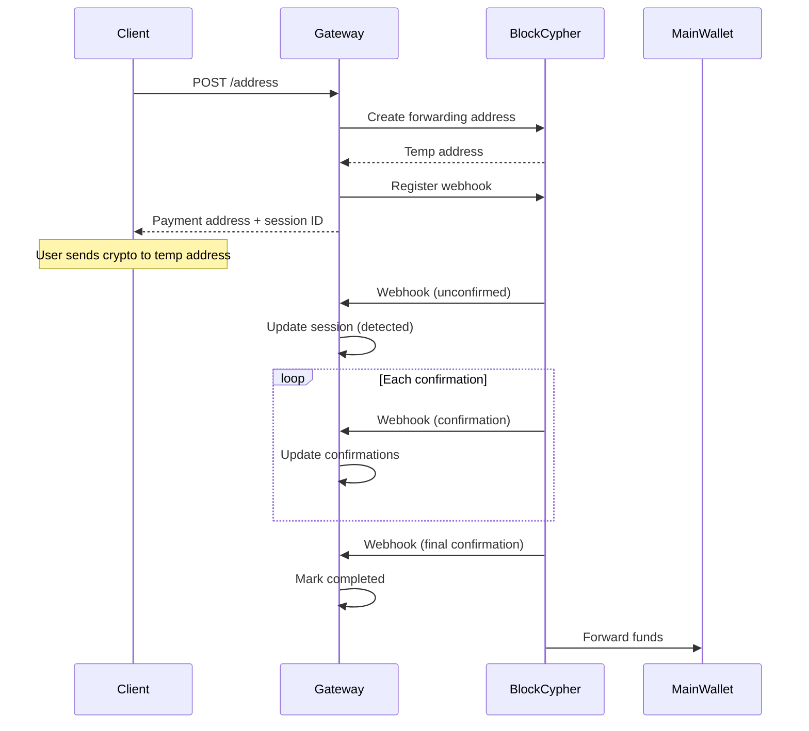

# CF-Finder Payment Gateway

A standalone Express.js payment gateway that integrates with BlockCypher API for BTC and ETH automated payments.

## Overview

This payment gateway automates the crypto payment process:
1. Generates temporary payment addresses using BlockCypher's Address Forwarding
2. Monitors transactions via webhooks
3. Tracks confirmations and marks payments as complete

## Architecture

```
payment/
├── src/
│   ├── app.js                 # Express server entry point
│   ├── config/
│   │   └── env.js             # Environment configuration
│   ├── controllers/
│   │   ├── address.controller.js    # Payment address creation
│   │   ├── session.controller.js    # Session management
│   │   └── webhook.controller.js    # BlockCypher webhook handler
│   ├── routes/
│   │   ├── address.routes.js
│   │   ├── session.routes.js
│   │   └── webhook.routes.js
│   ├── services/
│   │   ├── address.service.js       # BlockCypher address forwarding
│   │   ├── webhook.service.js       # BlockCypher webhook management
│   │   ├── payment-session.service.js # Payment session manager
│   │   └── confirmation.service.js  # Transaction confirmation logic
│   └── __tests__/
│       ├── address.service.test.js
│       ├── webhook.service.test.js
│       ├── payment-session.service.test.js
│       ├── confirmation.service.test.js
│       └── integration.test.js
├── .env.example               # Environment template
├── package.json
└── README.md
```

## Setup

### 1. Install Dependencies

```bash
cd payment
npm install
```

### 2. Configure Environment

Copy the example environment file and configure:

```bash
cp .env.example .env
```

Required environment variables:
- `BLOCKCYPHER_API_TOKEN` - Your BlockCypher API token
- `BTC_MAIN_ADDRESS` - Main BTC wallet address for forwarding
- `ETH_MAIN_ADDRESS` - Main ETH wallet address for forwarding
- `WEBHOOK_BASE_URL` - Public URL for receiving webhooks

### 3. Start the Server

```bash
# Development mode with auto-reload
npm run dev

# Production mode
npm start
```

## API Endpoints

### Create Payment Address
```http
POST /address
Content-Type: application/json

{
  "cryptocurrency": "btc",  // or "eth"
  "userId": "user123",
  "amount": 0.5,            // optional: expected amount
  "metadata": {}            // optional: custom metadata
}
```

Response:
```json
{
  "success": true,
  "data": {
    "sessionId": "uuid",
    "paymentAddress": "1TempAddress...",
    "cryptocurrency": "btc",
    "expectedAmount": 0.5,
    "expiresAt": "2024-01-01T12:00:00.000Z",
    "status": "pending"
  }
}
```

### Get Session
```http
GET /session/:id
```

### List All Sessions
```http
GET /session?status=pending&userId=user123
```

### Cancel Session
```http
DELETE /session/:id
```

### BlockCypher Webhook
```http
POST /webhook/blockcypher
```
(Called automatically by BlockCypher)

## Payment Flow



## Session States

| Status | Description |
|--------|-------------|
| `pending` | Waiting for payment |
| `detected` | Transaction seen in mempool |
| `confirming` | Has some confirmations |
| `confirmed` | Required confirmations reached |
| `completed` | Payment fully processed |
| `expired` | Session expired without payment |
| `cancelled` | Manually cancelled |
| `failed` | Processing error |

## Confirmation Thresholds

- **BTC**: 3 confirmations (~30 minutes)
- **ETH**: 12 confirmations (~3 minutes)

These can be configured via `BTC_CONFIRMATIONS_REQUIRED` and `ETH_CONFIRMATIONS_REQUIRED`.

## Event Handlers

The confirmation service emits events that can be used to trigger actions:

```javascript
import { confirmationService } from './services/confirmation.service.js';

// When transaction first detected
confirmationService.on('onPaymentDetected', async (data) => {
  console.log('Payment detected:', data.txHash);
});

// On each confirmation update
confirmationService.on('onConfirmationUpdate', async (data) => {
  console.log(`Confirmations: ${data.confirmations}/${data.requiredConfirmations}`);
});

// When payment reaches required confirmations
confirmationService.on('onPaymentConfirmed', async (data) => {
  console.log('Payment confirmed!');
});

// When payment is fully processed
confirmationService.on('onPaymentCompleted', async (data) => {
  // Update user balance in main database
  // Send notification to user
  console.log(`Payment completed for user ${data.userId}`);
});
```

## Testing

```bash
# Run all tests
npm test

# Run tests in watch mode
npm run test:watch

# Run tests with coverage
npm run test:coverage
```

## BlockCypher API Limits

- Free tier: 200 requests/hour, 3 webhooks
- Production: Consider upgrading for higher limits

## Security Considerations

### Webhook Security

The payment gateway implements webhook security using a secret parameter in the callback URL:

1. **How it works**:
   - When registering webhooks with BlockCypher, we include `PAYMENT_WEBHOOK_SECRET` as a query parameter in the callback URL
   - Example: `https://your-domain.com/webhook/blockcypher?secret=your-secret`
   - BlockCypher POSTs to this exact URL unchanged
   - Our webhook controller validates the secret before processing any webhook

2. **Configuration**:
   ```bash
   # Generate a strong secret
   openssl rand -hex 32
   
   # Add to .env
   PAYMENT_WEBHOOK_SECRET=your-generated-secret
   ```

3. **Validation behavior**:
   - **Development**: Warns if secret is not configured but allows processing
   - **Production**: Rejects all webhooks without valid secret (returns 401)

### Other Security Measures

1. **HTTPS**: Always use HTTPS for webhook URLs in production
2. **Private Keys**: Never store private keys if using generated addresses
3. **Rate Limiting**: Implement rate limiting on API endpoints
4. **IP Whitelisting**: Optionally whitelist BlockCypher's IP addresses

## Integration with Main Backend

To integrate with the main CF-Finder backend:

1. On `onPaymentCompleted`, call the main backend to update user balance:

```javascript
confirmationService.on('onPaymentCompleted', async (data) => {
  await fetch('http://main-backend/api/payments/confirm', {
    method: 'POST',
    headers: {
      'Content-Type': 'application/json',
      'Authorization': `Bearer ${INTERNAL_API_KEY}`
    },
    body: JSON.stringify({
      userId: data.userId,
      amount: data.amount,
      cryptocurrency: data.cryptocurrency,
      txHash: data.txHash,
      sessionId: data.sessionId
    })
  });
});
```

## License

ISC
